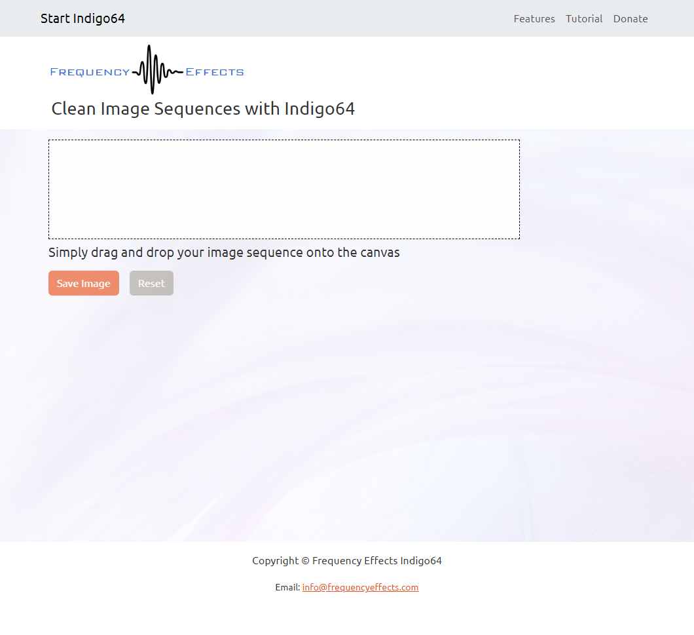

# Automatically remove moving satellites from ground based astronomical image sequences using Indigo64

# Automatically create Clean Plates from image sequences in a browser

# This website is available here [Indigo64](https://indigo64.app/).

## Introduction

I wrote this app for several reasons.

One reason is that I have a background in digital FX using Adobe After Effects and Autodesk 3ds Max.
Sometimes it was necessary to take an image sequence and create a "Clean Plate". This could mean painting out vehicles or maybe people to create a nice clean background image.
This clean image might then serve as a background for the insertion of 3d generated models into the scene.
It is a very labour intensive process to paint out unwanted objects.

Another reason was that I read that astronomers are a bit upset that Elon Musk's Starlink satellites often appear in image sequences taken from ground based telescopes.

I wondered would it be possible to automatically remove moving objects from image sequences by using a frequency based approach.

# The solution in non technical language

Consider a camera locked on a tripod which only has one pixel per image which is looking at the night sky.
Now consider taking a 4 second image sequence of 25 frames per second of the night sky. That is 100 frames/images in total.
Consider during those 4 seconds that a satellite passes over the camera for a duration of 1 second or 25 frames.

Inspecting the 100 frames might consist of 50 black frames, then 25 white frames(from the satellite) and finally 25 black frames.

It would be a reasonable statement to make that since the frames are mostly black, then this is probably the true color of the image. It is only white when the satellite is passing over.

Therefore by simply doing a frequency count of the rgb colors in the single pixel camera of the 100 frames we get 75 black pixels and 25 white pixels. Therefore we render the black pixel as the true image.

Since this process works for a single pixel camera it also works on a camera with more pixels. We just iterate through each pixel position and perform the frequency count of all pixels at that position and return the most frequently occuring pixel as the true color.

# The solution with some technical language

In general computers run fast. However they are not very fast at counting unique values in large datasets. Images contain many millions of pixels. Some large images can contain 100 million pixels or more.

Consider processing 500 images where each contains 100 million pixels. Doing frequency counts of pixels even on small images is a hard problem.

When I began this project I had no coding experience or exposure to any languages. My biggest concern was that I wanted a nice interface with buttons. I somehow stumbled on c++ with the Qt framework. I did understand in my head how to solve this and I thought that coding is probably quite an easy thing to do.

I was very wrong and it was a terrible experience trying to learn to code to even read an image into memory. I had no idea what I was doing. Then I came up against the Count Unique problem which happens to be one of the most difficult problems in computer science. Outfits like Google use a probability function called Hyper Log Log to solve counting problems for their large datasets.

The solution in my head seemed so easy and yet it seemed that it was an impossible task. I felt like I was cursed, however, I was too stupid and stubborn to give up. I tried and failed so many times. I got mad because I could not understand anything about coding. Nothing worked. The syntax always had errors. Code never did what it claimed to do except give me more errors. I actually still feel that way about CSS today!

I persisted though and eventually I got it to work. It blew my mind when the first rendered image came out. I was stunned. I still did not really understand the code that I had written but it damn well worked. It was extremely slow but it worked.

Now I was hooked on coding and learning and studying everything about it. I made many iterations and gradually made better loops, better use of memory.

I wanted to put it on the web so that people could use it. Now my new problem was I did not know how to make a website. So I end up learning React before I knew html or css or any javascript. I think it was meant to be the other way round.

So this brings me to today. I translated my project in c++, to React and javascript.
I discovered hash tables which makes counting even faster.

I slowly persisted through all the problems that React and javascript threw at me but this time I had the confidence that I had done battle before and prevailed.

The battle was just as difficult but I knew victory was always coming by never giving up.

This online version is actually better than the original but I have more to do.

As of April 2023 and the release of WebGPU, my next mission is to translate my application into parallel code and hopefully make it even faster.

I will update the Readme as I go.

## How to use Indigo64

Using Indigo64 is easy. The user simply drops the image sequence on the interface and waits a few minutes for the result.

The more important parts are taking appropriate images that can be processed. The camera can not move so it must be locked on a tripod. To eliminate moving objects the direction of travel should be orthogonal to the direction the camera is pointing.

In plain English it means that the objects should be crossing the camera and not travelling towards or away from the camera direction. The camera has to be able to see the background.
